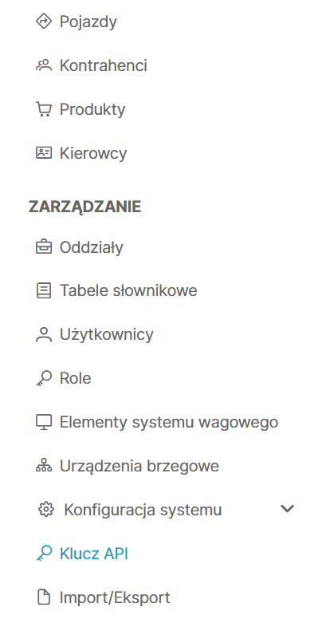
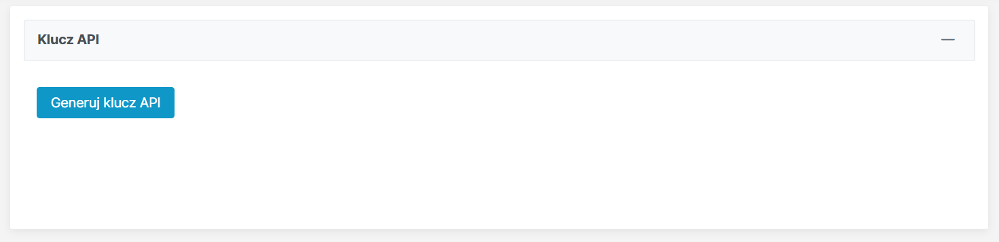
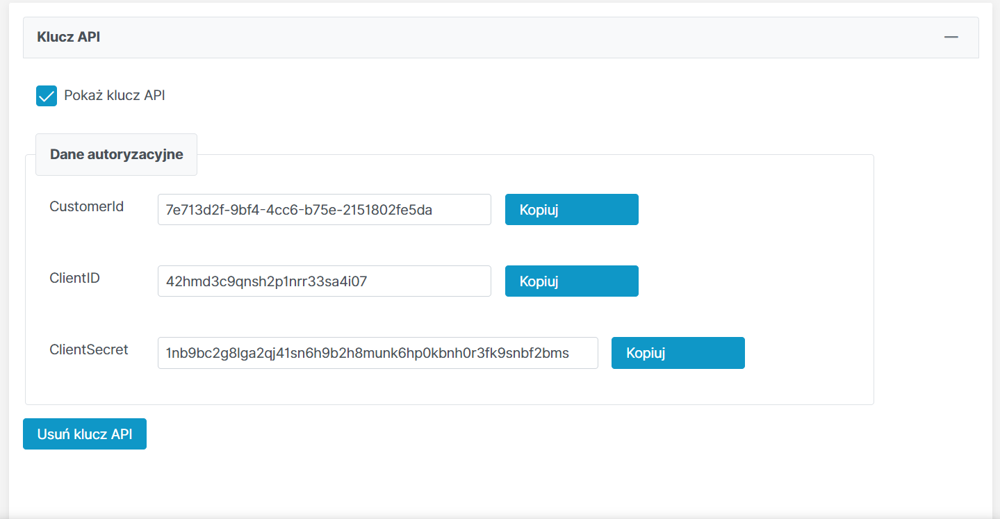

# Scaleo Examples API

Welcome to the Scaleo Examples API project! This repository contains examples and sample code for working with the Scaleo API.

## Installation

To install the project, run the following command:

```
npm install
```

## Getting Started

To start the example API, run the following command:

```
npm run start
```

Make sure to fill in the required environment variables before running the API.

### Environment Variables

Before running the API, you need to fill in the following environment variables in a `.env` file or in your preferred environment setup:

```
SCALEO_ADDRESS="https://api.scaleo.eu"
AWS_COGNITO_TOKEN_ENDPOINT=https://auth.scaleo.eu/oauth2/token
CUSTOMER_ID=<insert from scaleo>
CLIENT_ID=<insert from scaleo>
CLIENT_SECRET=<insert from scaleo>
```

Make sure to replace the values with the appropriate ones for your setup.

To generate 3 last values follow these steps:
Navigate to:

Then click blue button:

Then you are able to copy needed values:


## Usage

The example API app provides various examples and sample code for working with the Scaleo API.

## License

This project is licensed under the MIT License. See the LICENSE file for more information.

# Happy coding!
